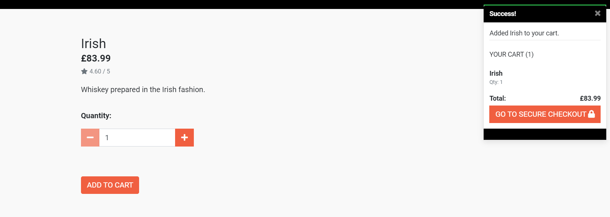
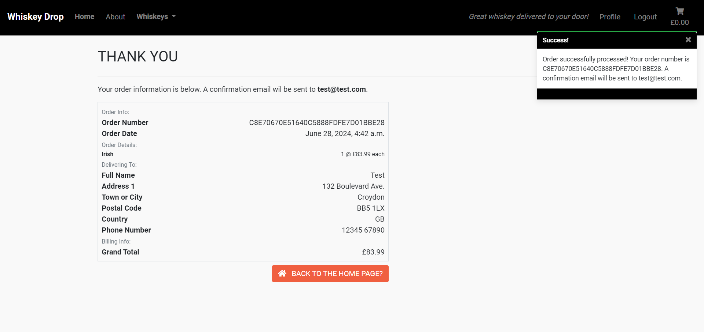
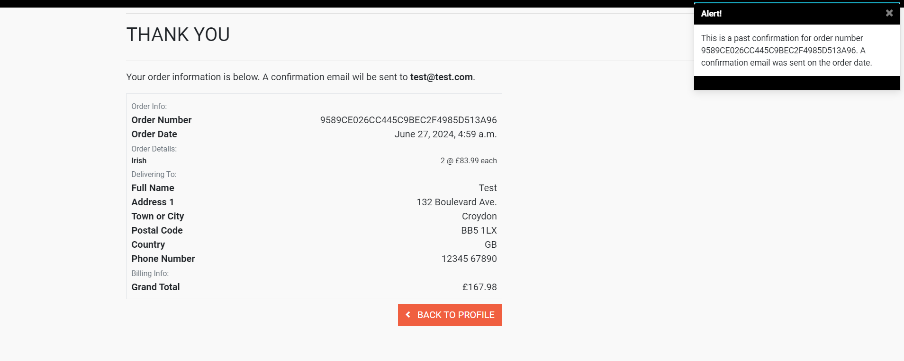
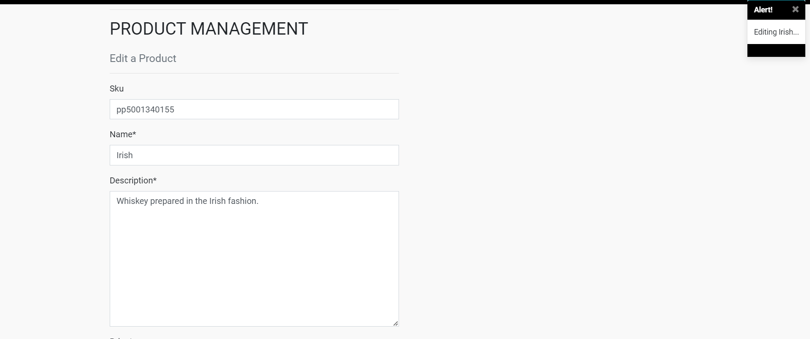

# Whiskey Drop (Deluxe)

Fourth Milestone Project for the Web Development course offered by Code Institute. A site for purchasing quality whiskey.

## Table of Contents
1. [UX](#ux)
	- [Project Goals](#project-goals)
	- [User Goals](#user-goals)
	- [User Stories](#user-stories)
	- [Design Choices](#design-choices)
2. [Planning](#planning)
	- [Wireframes](#wireframes)
 	- [Schema](#schema)
3. [Future Additions](#future-additions)
4. [Testing](#testing)
	- [User Stories Testing](#user-stories-testing)
 	- [Bugfixes](#bugfixes)
5. [Technologies Used](#technologies-used)
6. [Deployment](#deployment)
7. [Credit](#credit)

## UX

### Project Goals

The newly revamped Whiskey Drop allows customers to directly purchase a limited number of whiskeys, either as anonymous users or as registered users. Registered users have the added benefit of having their delivery and billing details saved (speeding up subsequent orders by autofilling the checkout form) as well as having their order history available.

### User Goals

- Simple design.
- Visually appealing.
- Easy to navigate.
- Secure purchases.

### User Stories

- As a user, I want to be able to browse whiskey easily.
- As a user, I want to be able to purchase whiskey easily and securely.
- As a user, I want confirmation of my orders.
- As a user, I want an account where my information can be stored.
- As a user, I want to be able to see my order history.

### Superuser Stories
- As a superuser, I want to be able to add new products to the site easily.
- As a superuser, I want to be able to edit existing whiskeys on the site.
- As a superuser, I want to be able to delete products that we no longer offer.
- As a superuser, I want a record of all orders to be added to the database.

### Design Choices

#### Interface

##### Regular

Whiskey Drop DX offers a sleek look.

The site lands on a jumbotron with a picture of whiskey in the back. Scrolling down reveals quotes from satisfied customers as well as (potential) features and monthly favourites.

Users can immediately browse the selection of whiskeys available.

Upon selecting a product, the user is taken to the product page, where they can add bottles to their cart.

Adding a product produces a little popup at the top right, showing that the item has been added and displaying the cart for convenience.

The cart is similar to the product pages. 

Here you can remove items from your cart or adjust the number of items in the cart. Once a user is satisfied, they can go to the checkout page.

Registered users can save their information, which will be preloaded on checkout and can be adjusted and updated here.

Stripe API implementation takes care of payment validation. The user receives a warning if there is any issue with their card details.

Once the user is satisfied, they can check out! If all goes well and payment is properly processed, an order details page is shown and a confirmation email is sent.

Speaking of the profile page...

Each profile sports a jumbotron similar to the main page, displaying the user's name. From here the user can edit their payment information directly as well as view their order history.

Specific orders can be revisited by clicking on their order number.

##### Superuser

Superusers - owners of the hypothetical Whiskey Drop - have several other advantages. They gain access to a 'Manage' button on their navbar, which they can use to add new products.

Superusers can also edit or delete existing whiskeys from their product pages.

Trying to delete a product summons a warning modal; selecting 'Delete' on this modal will actually delete the product.

## Planning

### Wireframes
No wireframes were created for this project.

## Testing

**Refer to [docs/account-details.txt](docs/account-details.txt) for superuser credentials and regular user accounts.**

The site has been tested extensively to ensure the best user experience across multiple screen sizes.

The developer used **W3C CSS Validation Service** and **W3C Markup Validation Service** to check the validity of the HTML and CSS.

### Testing Process

To make sure the site renders acceptably across several screen sizes, I made liberal use of the DevTools offered by Google Chrome, as well as testing load times, mobile and desktop, with the Lighthouse Chrome extension.

[Test for main page desktop version.](https://cosmiccode42.github.io/lighthouse-tests/whiskey-drop-dx-main-page-desktop-report.html)

[Test for main page mobile version.](https://cosmiccode42.github.io/lighthouse-tests/whiskey-drop-dx-main-page-mobile-report.html)

### User Stories Testing

As a user of the site, I want:
- to be able to browse whiskey easily.
	- Whiskeys are immediately available as a dropdown in the main nav bar.
 	- Tested that Whiskeys dropdown works and that links function properly.
- to be able to purchase whiskey easily and securely.
	- Secure checkout ensured via Stripe API.
 	- Tested that Stripe API functions properly (Stripe receives and processes payments, webhooks are functioning properly, etc).
- confirmation of my orders.
	- Order summary page displays all purchases.
	- Structure to allow confirmation emails to be sent has been laid.
 	- Tested that order summary page works as expected.
- an account where my information can be stored.
	- Added login system via allauth and added profiles app to display user profiles.
 	- Tested that accounts could be created successfully.
	- Ensured that login system functions as intended.
- to be able to see my order history.
	- Added order history to profile page.
 	- Tested that orders were correctly added to order history page.

As a superuser, I want:
- to be able to add new products to the site easily.
	- Added product creation functionality.
	- Tested that new products can be added properly.
	- Tested that only superusers can add products.
- to be able to edit existing whiskeys on the site.
	- Added product editing functionality.
	- Tested that existing products can be edited, and that product editing works properly.
	- Tested that only superusers can edit products.
- to be able to delete products that we no longer offer.
	- Added product deletion functionality.
	- Added modal to warn superusers as an extra precaution before deleting.
	- Tested that products can be deleted, but only after confirming deletion on the modal.
	- Tested that only superusers can delete products.
- a record of all orders to be added to the database.
	- Added order recording code and utilised webhook functionality.
	- Tested that all orders are added to the admin database properly.

### Bugfixes
- Problem: The top of the product details pages were covered by the navbar.
	- Solution: Added padding to the `heading-container` in `base.css` to account for this, and adjusted the `body` to compensate.
- Problem: The `quantity_input_script` I added to `product_detail` wasn't working - pressing either the + or - button just added directly to the cart.
	- Solution: I hadn't added a `` to my `base.html`, which is where the `quantity_input_script` was located. Adding the postloadjs block immediately fixed the issue.
- Problem: I could not adjust items in the cart or remove them from the cart.
	- Solution: I was missing a few key adjustments to my code (using the slim version of jQuery instead of the normal version, using `url adjust_cart` instead of `url 'adjust_cart'`, not adding a `/` to the end of the JavaScript and so on). After fixing all of these small issues, I was able to adjust and remove items from the cart without issue.
- Problem: When completing an order, the grand total was displayed as 0.00 on the `checkout_success` page and registered as 0.00 in the Orders database on the admin side.
	- Solution: I was missing an integral bit of code in the checkout app `apps.py` file, so the `signals.py` wasn't working. Adding this code fixed the issue immediately. 
		`def ready(self):` 
        - `import checkout.signals` 
- Problem: 12 hours after closing the workspace, webhooks stopped functioning properly. On Stripe, they returned a 401 (Unauthorised) error. No code had changed between closing the workspace and opening it again.
	- Solution: ... the webhooks just suddenly started working again. No change was needed. Perhaps there was some downtime or something?

## Technologies Used

### Building
- [HTML5](https://developer.mozilla.org/en-US/docs/Learn/HTML)
- [CSS53](https://developer.mozilla.org/en-US/docs/Learn/CSS)
	- [Bootstrap](https://getbootstrap.com/docs/4.6/getting-started/introduction/)
- [JavaScript](https://developer.mozilla.org/en-US/docs/Learn/JavaScript/First_steps/What_is_JavaScript)
- [Python](https://docs.python.org/3/)
    - [Django](https://docs.djangoproject.com/en/5.0/)
		- [Django Allauth](https://docs.allauth.org/en/latest/)
		- [Django Crispy Forms](https://django-crispy-forms.readthedocs.io/en/latest/install.html)
		- [Django Countries](https://pypi.org/project/django-countries/)
		- [Django Storages](https://pypi.org/project/django-storages/)
		- [Gunicorn](https://pypi.org/project/gunicorn/)
- [PostgreSQL](https://www.postgresql.org/docs/)
	- [psycopg2](https://pypi.org/project/psycopg2/)
- [Stripe API](https://stripe.com/gb)
- [Amazon Web Services](https://aws.amazon.com/what-is-aws/)
	- [boto3](https://boto3.amazonaws.com/v1/documentation/api/latest/guide/quickstart.html)

### Testing
- [Lighthouse](https://chromewebstore.google.com/detail/lighthouse/blipmdconlkpinefehnmjammfjpmpbjk)

### Validation
- [W3C CSS Validation](https://jigsaw.w3.org/css-validator/#validate_by_input)
- [W3C Markup Validation](https://validator.w3.org/#validate_by_input)

## Deployment
Deploy to Heroku or a similar website hosting and rendering service. The html files can also be opened from local storage (this requires downloading all files in a dedicated folder; this can be done with the git pull command), though the pages won't properly work without the Python code added.

To deploy this site to Heroku from [its GitHub repository](https://github.com/cosmicCode42/OC-archive), the following steps were taken.

1. Log in to a PostgreSQL database service.
2. Create a new PostgreSQL database. On Aiven, this is done by creating a new service. You must create a project beforehand, then add the service inside that project.
	- If needed, create a new database inside the service.
3. Copy the database URL (service URI on Aiven). Adjust the URL as needed.
4. Make sure to create a `requirements.txt` file with the terminal command `pip freeze --local > requirements.txt`. Make sure to save the file and add, commit and push it to your repository. (Unnecessary here since this project already has a requirements.txt file.)
5. Make sure to create a Procfile and add the command `web: gunicorn whiskey_drop_dx.wsgi:application` into it. Make sure to save the file and add, commit and push it to your repository. (Unnecessary here since this project already has a Procfile.)
6. Log in to [Heroku](https://www.heroku.com/).
7. Create a new app.
8. Go to the Settings of your app and click Reveal Config Vars. Add your copied database URL as `DATABASE_URL`, then add each of the other environmental variables: 
	- `IP` (usually set to `0.0.0.0`)
	- `PORT` (usually `5000`)
	- `SECRET_KEY` (you make a unique one)
	- **STRIPE:** `STRIPE_PUBLIC_KEY`, `STRIPE_SECRET_KEY`, `STRIPE_WH_SECRET` (for Stripe functionality)
	- **AWS:** `AWS_ACCESS_KEY_ID`, `AWS_SECRET_ACCESS_KEY`, `USE_AWS` (for AWS functionality - static and media file storage).
9.  Connect to your database manually via the terminal. This involves temporarily editing your database URL directly into the `settings.py` file, running migrations, and running `loaddata` if required to load any fixtures you have set up. DO NOT COMMIT YOUR WORK WHILE THE DATABASE URL IS IN THE FILE. Once the database connection is set up, you can edit `settings.py` to fetch your database URL from the environment variables (refer to current `settings.py` under `DATABASES`).
10. Go to the Deploy tab of your Heroku app. In the Deployment method section, select "Connect to GitHub". You can click "Enable Automatic Deploys" so that each time you commit to your GitHub repository, the Heroku app is redeployed.
11. Set up an AWS S3 bucket to host static and media files. (This is an involved process that I can't properly describe.) This is where the `AWS` access keys for your environmental variables will be gained. This is integral to making your static and media files function on the deployed site.
	- Add code to `settings.py` to connect to the bucket. (Refer to `S3 code` in `settings.py`.)
12. Redeploy with all resources set up.

If the steps are followed correctly, when opening the app, the website should be fully functional. The new database will be empty, so you will have to add new users.

At the moment of submitting the milestone project, the development branch and main branch are identical.

### How to run the project locally

To clone this project from GitHub:

1. Follow this link to [its GitHub repository](https://github.com/cosmicCode42/whiskey-drop-dx).
2. Under the Code dropdown menu in the Code section, you can copy the HTTPS link or download a ZIP.
3. A copied link can be used to make a pull request using Git Bash. 
	1. Change the current working directory to one where you want the clone to be made.
	2. Run ``git init`` to initialise a local repository.
	3. Run ``git remote add origin`` and paste the copied link right after. Running this command sets the GitHub repository as the 'origin'.
	4. Run ``git branch -M main`` if the local repository doesn't have a main branch.
	5. Run ``git pull origin main`` to make the pull request.

### Cloning project into GitPod

To clone this project into GitPod, you will need:
- A [GitHub](https://github.com) account.
- A Chrome browser or compatible browser.

Then follow these steps:
1. Install the [GitPod browser extension for Chrome](https://www.gitpod.io/docs/configure/user-settings/browser-extension).
2. Restart the browser after installation.
3. Log into [GitPod](https://www.gitpod.io) with your GitHub account.
4. Navigate into the [Project GitHub repository](https://github.com/cosmicCode42/whiskey-drop-dx).
5. Click the green **GitPod** button in the top right corner of the repository. This will trigger a new GitPod workspace to be created from the code in GitHub where you can work normally.

## Credit

### Code

Code not written by me and not covered below is attributed to proper sources in comments within the code. All other code is written by me.

- I relied heavily upon Code Institute's [Boutique Ado walkthrough](https://github.com/Code-Institute-Solutions/boutique_ado_v1) to make several integral parts of the code function. In particular, almost the entirety of my `settings.py` file and the `cart` and `checkout` apps (which deal with the Stripe API) were copied from a version of this I had coded, edited lightly for my purposes, and checked against the official code.

- The base HTML for the landing page comes from [my version](https://github.com/cosmicCode42/bootstrap-repo) of Code Institute's Whiskey Drop walkthrough project, edited heavily to function with Python. The rest of the site generally follows the same theme.